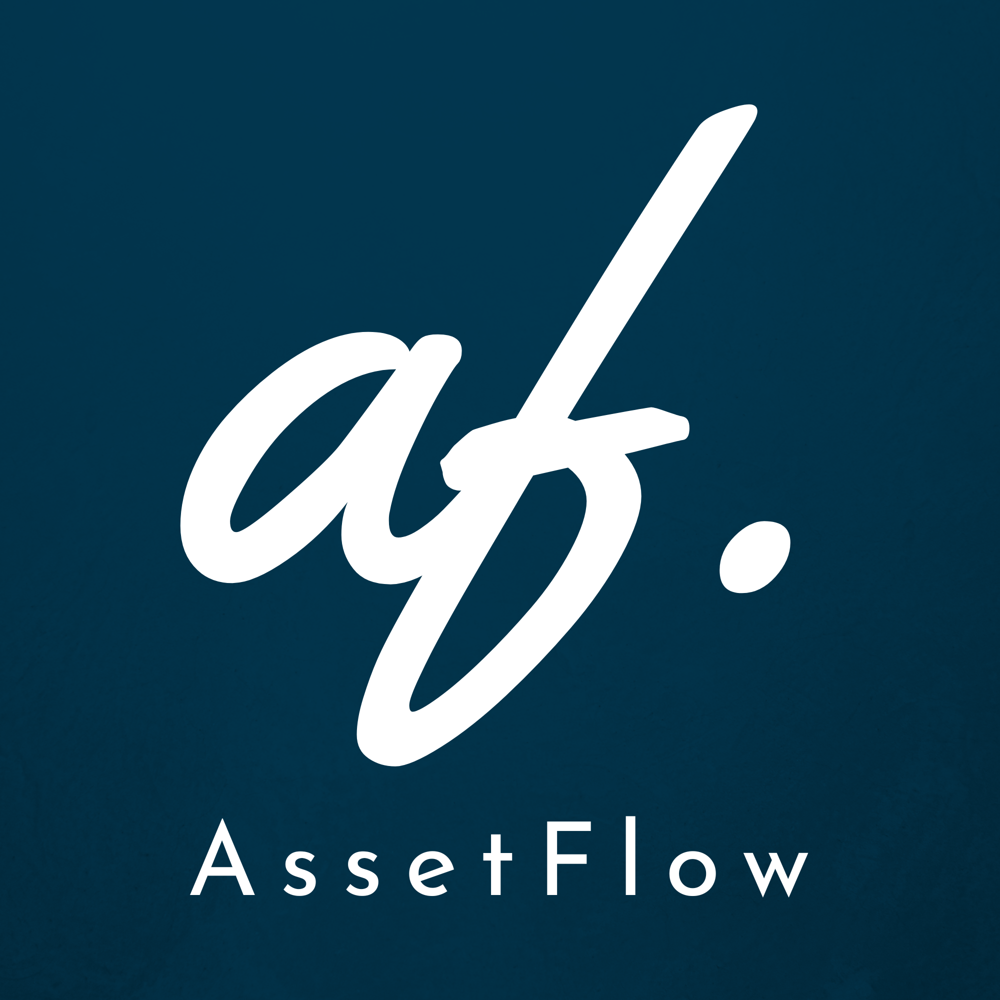

<div align="center">
  
  <h1>AssetFlow</h1>
  <p><strong>AI-powered IT Asset Management Platform</strong></p>
</div>

AssetFlow is a modern, full-stack application designed to track, allocate, and manage organizational assets intelligently. It provides real-time utilization insights, Kanban-driven maintenance workflows, and AI-powered recommendations in a clean, intuitive interface.

## ✨ Key Features

- **Asset Registry:** Keep track of every asset's complete lifecycle.
- **Secure Allocation:** Easily track who has what with a secure allocation system.
- **Maintenance Workflows:** Kanban-driven workflows to predict and schedule maintenance, preventing downtime.
- **Real-time Analytics:** Make data-driven decisions with real-time insights and utilization tracking.
- **AI Assistant:** Get smart, context-aware recommendations for asset optimization.
- **Dark/Light Mode:** First-class support for theming across the entire application.

## 🛠️ Tech Stack

**Frontend (`/client`)**
- React 18
- Vite
- TypeScript
- React Router DOM
- Lucide React (Icons)
- Vanilla CSS (with responsive layouts & CSS variables for theming)

**Backend (`/server`)**
- Node.js & Express
- TypeScript
- Prisma ORM
- JSON Web Tokens (JWT) & bcryptjs for Authentication

**Database (`/database`)**
- Managed via Prisma (Schema migrations & studio)

## 📁 Project Structure

```text
AssetFlow/
├── client/          # Frontend React application
│   ├── public/      # Static assets (including Logo & Favicon)
│   ├── src/         # UI components, pages, context, and styles
│   └── package.json 
├── server/          # Backend Express server
│   ├── src/         # API routes, controllers, and middlewares
│   └── package.json
└── database/        # Prisma schema and database configuration
```

## 🚀 Getting Started

### Prerequisites
- Node.js (v18 or higher)
- npm or yarn

### Installation

1. **Clone the repository:**
   ```bash
   git clone https://github.com/code-manush/AssetFlow.git
   cd AssetFlow
   ```

2. **Install Backend Dependencies:**
   ```bash
   cd server
   npm install
   ```

3. **Install Frontend Dependencies:**
   ```bash
   cd ../client
   npm install
   ```

4. **Setup Database:**
   ```bash
   cd ../database
   npx prisma generate
   npx prisma db push
   # Alternatively, seed your database with mock data if a seed script exists
   ```

### Running the Application Locally

You will need to run the client and the server concurrently.

**Run the Backend Server:**
```bash
cd server
npm run dev
```

**Run the Frontend Client:**
```bash
cd client
npm run dev
```

**Run Prisma Studio (Optional for DB management):**
```bash
cd database
npx prisma studio
```

Open [http://localhost:5173](http://localhost:5173) to view the application in your browser.


## 📜 License
This project is licensed under the MIT License.